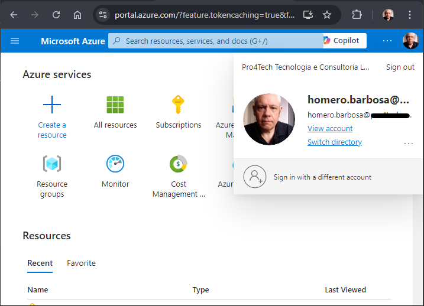
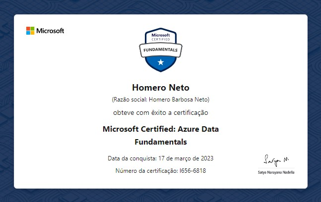

# Microsoft Azure

Venho adquirindo e aplicando conhecimentos nesta plataforma, desde Agosto/2020 nos recursos abaixo:

## Implantação de recurso, Migração de AD, Desenvolvimento e Implantação de projeto.

    * VMs - SO Windows Server:
        Implantação de sistema aspnet(.Net).

## Implantação de recurso, Migração de AD, Desenvolvimento e Implantação de projeto.

    * Serviço de aplicativos - SO Linux / SO Windows:
        Implantações aplicadas na IDE Visual Studio, VS Code, linha de comando(powershell): Sistemas aspnet(.Net), React(Node), WebSite Estático.

## Implantação de recurso, Migração de AD, Desenvolvimento POC.

    * Contas de Armazenamento;

## Implantação de recurso, Desenvolvimento POC, Implantação de projeto.

    * ServiceBus: Mensageria: Filas.

## Implantação de recurso, Desenvolvimento POC, Implantação de projeto.

    * Serviços Cognitivos do Azure: Computer Vision.
    * Azure OpenAI: GPT-turbo 3.5, GPT-4, GPT-4o.

## Implantação de recurso, Migração de AD, Implantação de projeto.

    * Banco de dados SQL Azure, modelo de compra(DTU), banco único ou pool de bancos:
        Implantação, importar/exportar dados.

